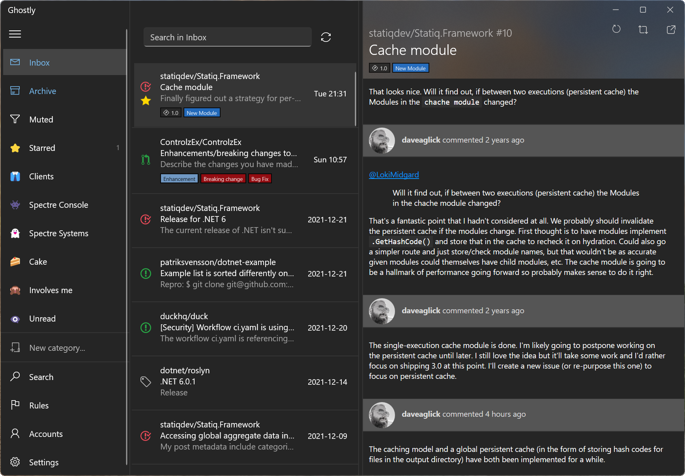
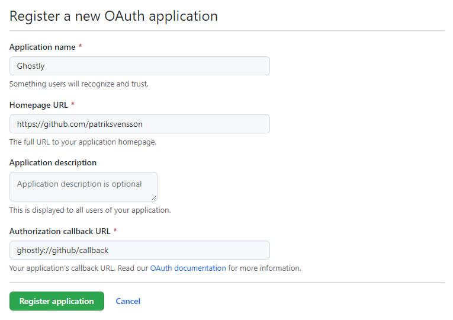
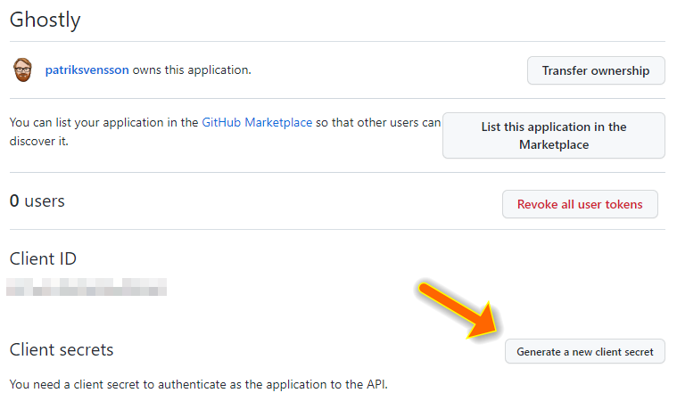

# Ghostly

Ghostly is a GitHub notification client for Windows 10/11.



* A lot of notifications can be overwhelming sometimes. Organize your work by categorizing and filtering notifications just like you want to.
* Ghostly is built with offline use as a first class citizen. Synchronize your notifications when you're online and continue using Ghostly like normal when you're offline.
* Keeping track of notifications for issues, PRs, vulnerabilities or releases have never been easier. Ghostly have built in support for things such as rules for incoming notifications, categories, filters and a powerful query language.
* With a lot of notifications - even when categorized properly - it might sometimes be difficult to find that one thing that you're looking for. With the Ghostly query language, your notifications have never been easier to find.
* Whether you prefer a light or a dark theme, Ghostly got you covered. By default Ghostly respects your Windows theme, but you can easily override this in Ghostly's settings.

## How to install

The recommended way of installing Ghostly is via the Microsoft Store.  
Ghostly requires Windows 10, version 1809 to run.

<a href="https://www.microsoft.com/store/apps/9N5MVRB0XC60?cid=storebadge&ocid=badge"></a>

## Building Ghostly

### 1) Install Cake

First make sure that you have Cake installed.

```
> dotnet tool restore
```

### 2) Create a GitHub OAUTH application

Go to your GitHub account settings and create a new OAUTH application
at https://github.com/settings/applications/new.

make sure to set the `authorization callback URL` to
`ghostly://github/callback`



After clicking `Register application`, make sure that you click the
button `Generate a new client secret`.



After this is done, write down the Client ID and the generated Client secret.
You're going to need them later to configure Ghostly.

### 3) Generate the code containing the client ID and client secret

From the root of the repository, run the following command.
Don't forget to insert the client ID and client secret from the previous step

```
> dotnet cake bootstrap.cake --client-id "MY-CLIENT-ID" --client-secret "MY-SECRET"
```

Once run, there should be a file at `./src/Ghostly.GitHub/GitHubSecrets.Generated.cs`.

Note that the OAUTH client ID and client secret does not grant you any rights on
behalf of the user who created it, so even though it's not the end of the world if
someone would disassemble our application, this file has been added to the .gitignore 
and should not be checked in.

### 4) Build Ghostly

To build a full release for all available platforms, run the following from the command line:

```
> dotnet cake --full
```

Please note that this will take a while.

### 5) Run Ghostly

If everything went fine, there should artifacts available at
`./.artifacts/packages`.